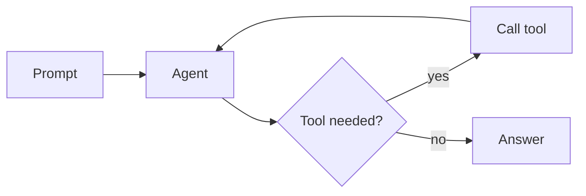

# sldr worked examples

Complete, copy-pasteable decks. Each shows the files plus the commands. Slides live in `~/sldr/slides/`, playlists are created from JSON, builds land in `~/sldr/presentations/`.

---

## 1. A simple three-slide deck

`~/sldr/slides/intro.md`:

```markdown
---
title: Shipping faster with less
layout: cover
---
A short talk · 2026
```

`~/sldr/slides/idea.md`:

```markdown
---
title: The idea
layout: two-cols
---
::left::
### Before
Hand-tuned, fragile, slow to change.
::right::
### After
One source, restyled in a command.
```

`~/sldr/slides/close.md`:

```markdown
---
title: Thank you
layout: end
---
questions?
```

Build and present:

```bash
echo '{"name":"short-talk","title":"Short talk","slides":["intro","idea","close"]}' | sldr playlist create
sldr build short-talk --flavor fjord
sldr open short-talk
# audition other looks without touching content:
sldr build short-talk --flavor aurora     # or letterpress, blueprint, sakura, …
```

---

## 2. A branded deck (framed layouts + a flavor with chrome)

The `framed-*` layouts read chrome from frontmatter and logos/background/footer from the flavor. A slide:

`~/sldr/slides/brand-point.md`:

```markdown
---
title: Why this matters
subtitle: the one-line takeaway
layout: framed
footer: "© Acme Corp"
---
- Persistent header, footer, logos, and background come from the layout + flavor.
- You only write the content.
```

A matching flavor `~/sldr/flavors/acme/flavor.toml` (logos + background live in `assets/`):

```toml
name = "acme"
footer = "© Acme Corp"
font_imports = ["assets/fonts.css"]      # ship the font; renders anywhere

[colors]
background = "#0a1018"
text = "#eef3f8"
accent = "#46a8e6"

[background]
background_type = "svg"                   # embedded at build; or "color"/"gradient"/"image"
value = "bg.svg"

[[logos]]
file = "logo.png"
x = "76%"
y = "2%"
width = "20%"
layouts = ["framed", "framed-cols", "framed-image", "framed-cover", "framed-section"]
```

```bash
sldr build acme-deck --flavor acme
```

---

## 3. A web-clipping slide (source line) and the scatter layout

`source` + `source_url` render a "Source: …" link above the footer. For "an article plus a wall of examples", use `framed-scatter` (content/article left, overlapping image collage right):

```markdown
---
title: Text-to-Image
subtitle: what the models can do now
layout: framed-scatter
source: "Article title | Publication"
source_url: https://example.com/article
---
::left::

::right::


```

For a single web clipping, use `framed` with one image as the body; for a tidy grid, `framed-gallery`.

---

## 4. A multilingual slide (one file, two languages)

```markdown
---
title: Shortcuts
layout: center
---
::lang:en::
**O** overview · **D** dark mode · **L** language · **E** edit
::lang:de::
**O** Übersicht · **D** Dunkelmodus · **L** Sprache · **E** Bearbeiten
```

```bash
sldr build talk --lang en          # English
sldr build talk --lang de          # German
sldr build talk --lang en,de       # embed both; press L to switch live
```

Content before the first `::lang::` marker is shared by all languages. A requested language a slide lacks warns and falls back to the deck default — never silently.

---

## 4b. A bilingual content+image slide — generated from JSON (no markers by hand)

The fiddly case — framed chrome + per-language text + a **shared** image — is best generated with `sldr slides create` rather than hand-written. You give a flat object; sldr writes the `translations.<lang>` frontmatter, the `::lang::` blocks, and pairs the text with `::content::` (because the shared body has an `::image::`):

```bash
sldr slides create <<'JSON'
{"slides":[{
  "name":"launch-clip",
  "title":"Launch headline",
  "layout":"framed-image",
  "subtitle":"one-line context",
  "source":"Publication | Site",
  "source_url":"https://example.com/article",
  "content":"::image::\n\n",
  "translations":{
    "en":{"content":"The English caption for the clipping."},
    "de":{"title":"Schlagzeile","subtitle":"Kontext in einem Satz","source":"Publikation | Seite","content":"Die deutsche Bildunterschrift."}
  }
}]}
JSON
```

→ a correct `~/sldr/slides/launch-clip.md` with the image declared once, `::lang:en::`/`::lang:de::` each wrapped in `::content::`, and translated chrome — builds with `--lang en,de` and no marker warnings. (Copy-a-template alternative: `sldr new launch-clip --scaffold translated-figure`, then fill it in.)

---

## 4c. A diagram slide (mermaid, rendered offline)

A ` ```mermaid ` fence renders as a real diagram — no screenshot, no external service. Shown with a `~~~` outer fence so the inner triple-backticks are literal:

~~~markdown
---
title: The agent loop
layout: framed
---

~~~

Mermaid is bundled and runs client-side (offline; inlined only into decks that use it). For a static chart instead, generate an SVG and reference it: ``.

---

## 5. Sharing

```bash
sldr build talk --single-file        # one HTML file to email (media inlined)
sldr bundle talk                     # talk.sldr — editable sources; recipient runs `sldr open talk.sldr`
sldr watch talk --host 0.0.0.0       # live preview on the LAN while authoring
```
